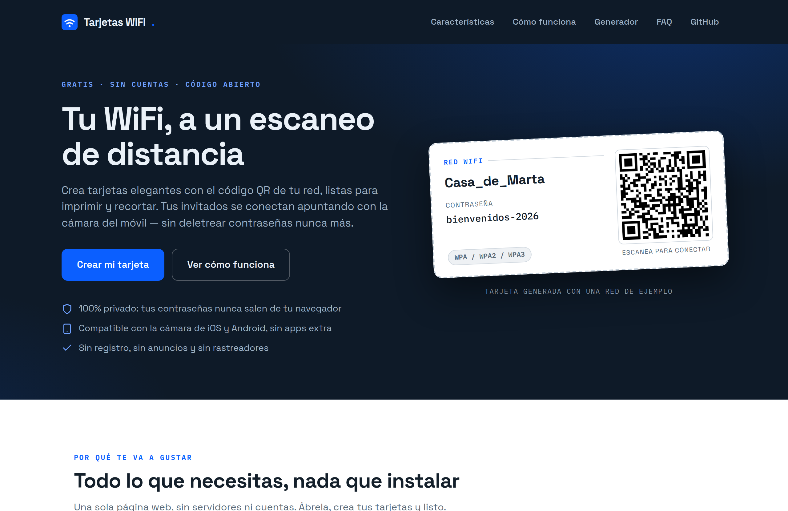
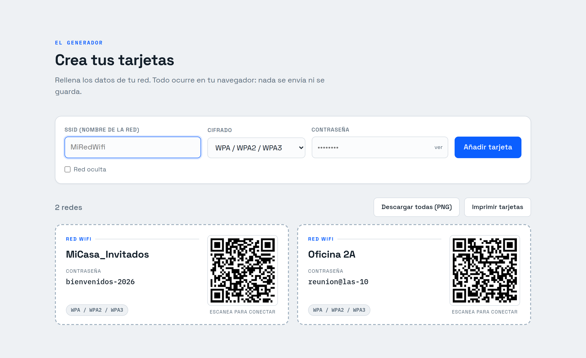
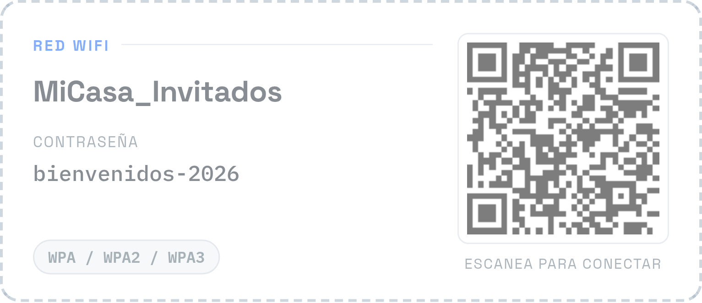

# 📶 WiFi Cards — Printable WiFi QR Card Generator

**🌐 Live demo: [wifi-qr.poldotras.com](https://wifi-qr.poldotras.com)**

Generate printable cards with your WiFi network credentials and a QR code that connects devices just by scanning it with the phone camera. Everything runs **100% in the browser**: passwords never leave your machine.

Perfect for guest rooms, offices, cafés, classrooms, events — or just to stop spelling out your password letter by letter.



## ✨ Features

- **Unlimited cards**: add as many networks as you want.
- **Standard WiFi QR format** (`WIFI:T:...;S:...;P:...;;`): natively supported by the iOS and Android camera apps, no extra apps needed.
- **Supported encryption**: WPA / WPA2 / WPA3, WEP, and open networks.
- **Hidden networks**: option to flag the SSID as hidden (`H:true`).
- **Proper escaping** of special characters (`\` `;` `,` `"` `:`) in the QR payload.
- **Print**: dedicated print stylesheet with cards laid out in 2 columns and dashed cut-out borders. You can also save them as PDF from the print dialog.
- **Download as PNG**: each card individually or all at once, in high resolution (3x).
- **Fully self-contained**: no CDN, no external fonts, no backend, no accounts, no tracking. Once loaded it even works offline.
- **Hardened**: strict Content Security Policy (`script-src 'self'`), all dependencies vendored locally.
- **Legal notice included**: accessible from the footer (identification, terms of use, privacy).

## 🚀 Usage

Use it directly at **[wifi-qr.poldotras.com](https://wifi-qr.poldotras.com)**, or run it yourself — nothing to install or build:

1. Clone the repo (or download it as ZIP).
2. Open `index.html` in any modern browser.
3. Fill in SSID, encryption and password → **Añadir tarjeta**.
4. Print the sheet and cut along the dashed lines, or download each card as PNG.



And this is what a finished card looks like — scan it with your phone camera to try it (it's a fictional network):



You can also serve it statically (GitHub Pages, Nginx, `python -m http.server`...) with zero configuration.

## 🔒 Privacy & security

- All processing (form, QR, PNG) happens client-side. **Zero network requests**: libraries and fonts are served locally, so no CDN or font provider sees your visit.
- No analytics, no cookies, no local/remote storage.
- Cards live in memory only: reloading the page clears them. This is deliberate — passwords are never persisted in the browser.
- The password field is masked with CSS (`-webkit-text-security`) instead of `type="password"`, so the browser's password manager never offers to save (or sync) your WiFi key.
- A strict Content Security Policy (`default-src 'none'; script-src 'self'; ...`) blocks any unexpected external resource or injected script.
- The footer includes a legal notice & privacy statement (in Spanish, per Spain's LSSI-CE).

## 🛠️ Tech

| Component | Purpose |
|---|---|
| Vanilla HTML + CSS + JavaScript | The whole app, no frameworks, no build step |
| [qrcodejs](https://github.com/davidshimjs/qrcodejs) (MIT, vendored) | QR code generation |
| [html2canvas](https://github.com/niklasvh/html2canvas) (MIT, vendored) | Exporting cards to PNG |
| [Space Grotesk](https://fonts.google.com/specimen/Space+Grotesk) & [IBM Plex Mono](https://fonts.google.com/specimen/IBM+Plex+Mono) (SIL OFL, self-hosted) | Typography |

```
index.html            Landing page + generator + legal notice
assets/styles.css     All styling, including the print stylesheet
assets/app.js         Application logic
assets/vendor/        qrcodejs + html2canvas (vendored, no CDN)
assets/fonts/         Self-hosted woff2 fonts
docs/                 Screenshots used in this README
```

## 📄 QR format

Cards use the standard WiFi network configuration QR format:

```
WIFI:T:<WPA|WEP|nopass>;S:<ssid>;P:<password>;H:true;;
```

- `T`: encryption type (`WPA` covers WPA/WPA2/WPA3, `nopass` for open networks).
- `S`: SSID.
- `P`: password (omitted for open networks).
- `H:true`: only present for hidden networks.

## 🤝 Contributing

Issues and pull requests are welcome. Some pending ideas:

- [ ] Optional `localStorage` persistence (with a security warning)
- [ ] Export/import the network list as JSON
- [ ] Dark mode
- [ ] Internationalization (ES/CA/EN/...)

## 📜 License

[MIT](LICENSE) — use it, modify it and share it freely.
